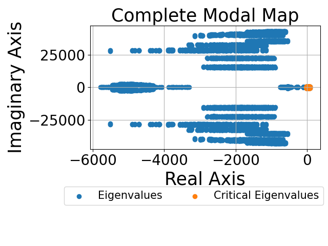
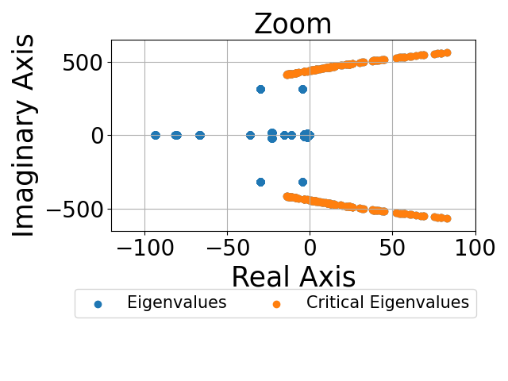

# Identification of Groups of Critical Eigenvalues
Codes for analyzing the results of the small-signal stability assessment collected in the training data set and identifying the groups of critical eigenvalues.

  
  

## Usage
run the code critical_eigenvalues.py
